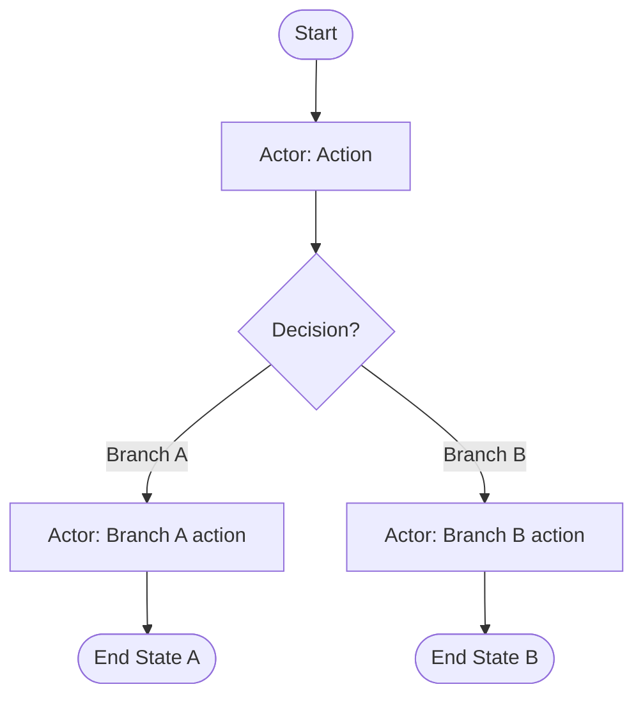

# Generate BAW BPMN

Produce a BPMN 2.0 file that imports successfully into IBM BAW on the first attempt.
The reliability comes from three deliberate choices:

1. **You decide, the tool writes.** You read the user's process description and capture
   your judgment -- steps, decisions, branching, data -- as a small process JSON. The
   bundled `scripts/generate_baw_bpmn.py` deterministically converts it to XML. Never
   hand-write BPMN XML: ids, references, and namespace details are exactly the kind of
   fussy output that must come from a generator, not a fresh guess.
2. **The XML is BAW's own dialect.** The generator reproduces the format BAW itself
   exports -- `bpmnid-` UUID ids, `processType="None"`, named flows, no diagram
   section, no lanes (see `references/BAW_BPMN_DIALECT.md` for why). What BAW
   writes, BAW reads.
3. **Only mappable constructs exist.** Every element type the config schema allows maps
   1:1 to a row in IBM's documented import mapping. Anything BAW would silently drop or
   lossily convert is rejected at validation time, where it's cheap to fix.

Ids are derived deterministically (uuid5) from the config, so regenerating the same
config yields byte-identical XML and every `sourceRef`/`targetRef` is guaranteed to
resolve.

## Model completeness

A short linear happy-path with one flat business object is almost always
under-modeling. Before writing the config, read `references/MODELING_COMPLETENESS.md`
-- it covers what to check for on the process side (roles, decision-point outcomes,
exception/rework loops, SLA/escalation timers, multiple end states, parallel work) and
on the data side (expanding each business object to its natural fields, nested/list
objects, status fields, and wiring variables to every task that touches them). Match
your draft against it before treating it as complete.

## Steps

### Guided conversation — always run phases 1–4 before writing any config

Do not skip to config authoring. Walk through these phases first. One question per turn.

**Question style.** For discrete judgment calls — human vs. system performer, which
gateway branch is the default, whether a task needs an SLA timer — prefer a structured
choice question (the `AskUserQuestion` tool, when available) over open-ended text: it's
faster to answer and it surfaces options the user might not have thought to ask for.
When `AskUserQuestion` isn't available, ask a single question that spells out the
concrete options instead of leaving it open-ended.

---

#### Phase 1 — Purpose and source discovery

**When to ask about the process:** If the user has NOT already stated what process they want to model.

**When to skip:** If they've clearly described a process (e.g., "I need a BAW process for expense approvals"). Move straight to the documentation check below.

Ask one focused question:

> "What process are you looking to model in BAW? For example: an approval workflow, an onboarding process, a claims handling flow."

Once you know the process name and rough goal, **immediately ask about supporting documentation** — one question, conversationally:

> "Before I start modeling, do you have anything that describes this process in more detail? A requirements doc, business blueprint, SOP, swimlane diagram, meeting notes, or even a rough flowchart would all help me build a more accurate model. If not, no problem — I'll work from what you've shared."

**When to skip the documentation question:** Skip it if:
- The user's original message already includes a document or attachment, **or**
- The user has explicitly said they have no documentation.

Always ask the documentation question for any other case — including short conversational descriptions like "make a process for an orange juice stand." A brief description does not imply the user has no supporting material; ask before assuming.

If the user provides a document, read `references/EXTRACTING_FROM_DOCUMENTS.md` first — it maps document language to config constructs and requires each distinct process in the document to become its own config/BPMN. The document is the source of truth: extract, don't invent.

Then move to Phase 2. Do not ask for anything else yet.

---

#### Phase 2 — Process plan

After the process is known (and after reading any source document), **always present a numbered Markdown plan followed immediately by a Mermaid flowchart before writing any config or JSON**.

Present the plan using this format:

**Sequential:**
```
### [Process Name] plan:
1. [Actor] [action]
1. [Actor] [action]
1. [Actor] [action]
```

**With decisions:**
```
### [Process Name] plan:
1. [Actor] [action]
1. Decision: [condition]?
    * If [option]:
        1. [Actor] [action]
        1. [Actor] [action]
    * If [alternative]:
        1. [Actor] [action]
1. [Actor] [action]
```

Immediately after the numbered plan, render a Mermaid flowchart of the same process using this format:

```
### [Process Name] diagram:

```

Mermaid rules:
- Start/end events: `(["Label"])` — round ends
- Human and service tasks: `["Label"]` — rectangles
- Gateways: `{"Label?"}` — diamonds
- Non-interrupting timer boundary events: dashed arrow from the task `task_a -.-> timer_node`
- Label every gateway branch with `-->|"branch name"|`
- Loop-back edges (e.g. retry) are allowed — Mermaid handles them
- Keep node ids short and snake_case (e.g. `gw_payment`, `task_submit`)
- Read `references/VISUAL_REVIEW.md` for the legend/color/swimlane conventions and
  apply them here: a one-time legend on the first diagram, `classDef` color-coding by
  role, and swimlane subgraphs only where the process actually has contiguous
  same-actor blocks
- If the user asks to change the plan, re-present the full updated numbered plan with
  removed steps struck through and new steps bolded (see `references/VISUAL_REVIEW.md`
  for the exact convention), plus a clean re-rendered diagram

Rules for the numbered plan:
- Use `1.` for all numbered steps (Markdown auto-numbers)
- `Decision: [question]?` for every gateway
- `* If [condition]:` for branches, tasks indented underneath
- `[Actor] [verb] [object]` — concise, action-oriented
- Do NOT nest decisions inside other decision branches
- Do NOT write any config JSON during this phase
- Note any assumptions inline (e.g., *"Assuming manager approval is required before payment"*)

**Completeness check.** Pattern-match the plan against `references/MODELING_COMPLETENESS.md`
and render a short visible checklist beneath the diagram, e.g.:
```
### Completeness check:
✅ Roles assigned to every step
✅ 2 outcomes on "Approved?"
❌ No SLA timer — description says "within 3 business days"
✅ Distinct end event per outcome
```
If anything is ❌, ask about the flagged gaps in one question before moving on — a
multiSelect `AskUserQuestion` listing each gap as an option (plus "none of these, this
is fine as is") when available, otherwise one plain question listing them. If
everything is ✅, skip straight to the closing question below.

**Publish the review artifact.** If the `Artifact` tool is available, publish the plan
and diagram together per `references/VISUAL_REVIEW.md` and share the link. Update the
same artifact (same file path, same URL) on every later revision instead of publishing
a new one each turn.

End with exactly this question:
> Would you like to include business object data types for this process?

If the user says **no**: ask exactly:
> You can continue to modify this plan, generate the BPMN for it as-is, or start over with a different process. How would you like to proceed?

---

#### Phase 3 — Data model proposal

Triggered **only when the user says "yes"** to including business object data types.

Re-present the plan annotated with `(inputs: TypeName; outputs: TypeName)` per step, followed immediately by the Mermaid diagram (unchanged from Phase 2 unless the plan was modified), then the proposed business objects in YAML:

**Annotated plan:**
```
### [Process Name] plan:
1. [Actor] [action] (inputs: TypeA; outputs: TypeB)
1. Decision: [condition]?
    * If [option]:
        1. [Actor] [action] (inputs: TypeB; outputs: TypeC)
    * If [alternative]:
        1. [Actor] [action] (inputs: TypeA; outputs: TypeD)
1. [Actor] [action] (inputs: TypeC, TypeD; outputs: TypeE)
```

Then the Mermaid diagram (same rules as Phase 2; update it only if the plan changed):


**Proposed business objects:**
```
### Business objects for [Process Name]:
```yaml
- SupportTicket:
    id: String
    subject: String
    description: String
    priority: String
    status: String
    submittedDate: Date
    submittedBy: String

- TriageResult:
    ticketId: String
    outcome: String
    assignedTo: String
    triageDate: Date
    isDuplicate: Boolean
```

Rules for the data model:
- PascalCase object names, camelCase field names
- Supported primitives: `String`, `Integer`, `Decimal`, `Boolean`, `Date`, `Time`, `DateTime`
- Show 4–7 fields per object — representative of a real system record, not just the fields mentioned in the description
- Include a `status` or `outcome` field on every process-controlled object
- Include nested/list objects when the domain naturally has them (order → line items)
- Do NOT generate JSON config yet

Alongside the YAML, render an `erDiagram` of the business objects (nested/list fields
become relationships — see `references/VISUAL_REVIEW.md` for the exact syntax and
cardinality convention), and if the review artifact from Phase 2 was published, update
it (same file path) to include the data model and ER diagram.

End with exactly this question:
> Would you like to refine these business objects, or shall I create the importable BPMN for you?

If the user wants to refine: re-present the **complete** updated YAML block — never show partial changes. Repeat the closing question after each revision.

---

#### Phase 4 — Generation confirmation

**Skip this phase entirely if the user just confirmed at the end of Phase 3** (i.e., they responded to "Would you like to refine these business objects, or shall I create the importable BPMN for you?" with "proceed" or equivalent). That response is already the confirmation — asking again is redundant.

Only ask this question when arriving directly from Phase 2 (no data model was proposed):
> Shall I go ahead and create the importable BPMN for you?

If yes → proceed to steps 1–6 below, using the confirmed plan and data model as the authoritative source of truth (not just the original description).

If no → ask:
> You can continue to modify the plan or business objects, or start over. How would you like to proceed?

**Never write any files before receiving confirmation here.**

---

1. **Supporting documentation** was handled in Phase 1. If the user provided a document
   there, read `references/EXTRACTING_FROM_DOCUMENTS.md` now — it maps document language
   to config constructs (action verbs → tasks, decision language → gateways, SLA phrasing
   → timer boundary events, described data → business objects), tells you how to handle
   gaps, and requires each distinct process in the document to become its own config/BPMN.
   The document is the source of truth: extract, don't invent, and carry assumptions into
   element documentation and your report.

2. **Understand the process.** Get or infer from the confirmed plan: the process name,
   the process app name (optional -- used in the targetNamespace, defaults are fine),
   the ordered activities, who/what performs each (human step vs automated step),
   decision points and their outcomes, and the business data moving between steps.
   The confirmed plan and data model from phases 2–3 are the source of truth here —
   do not re-derive from the original description if the user has refined it.

3. **Read `references/PROCESS_JSON_SCHEMA.md`** -- the authoritative config schema with
   five worked examples (linear, approval + escalation, parallel, service-flow-heavy
   with subprocess, and a full nested-business-object data model). Pattern-match the
   closest example instead of starting blank. The key modeling decisions:
   - Human step → `userTask` (BAW generates a client-side human service for it).
   - Automated step → `serviceTask`. **This is how service flows are generated:** BAW
     creates one service flow per serviceTask, named after the task -- so name each
     serviceTask exactly what its service flow should be called, and put the intended
     logic in the element's `documentation`.
   - Decision → `exclusiveGateway` with named outgoing flows, a `condition` on each
     branch and `isDefault: true` on exactly one.
   - Concurrency → paired `parallelGateway` fork/join. Deadlines/failures →
     `boundaryEvent` (timer/error) on the task. Repeated inner logic → `subProcess`.
   - Structured business data → `businessObjects` (nested fields, lists, references)
     plus `variables` typed with those object names. The generator emits them as a
     sidecar `.xsd` bundled into the same zip, which BAW imports as real business
     objects; simple `xsd:*` variables need no XSD.
   - Add a `roles` section to name the actors (human roles, teams, systems) and
      reference each role from its tasks via `"role": "<roleId>"`. The generator
      emits one swim-lane per role (`<laneSet>/<lane>`) plus a `<performer>` on each
      task — BAW uses these to create swim-lanes and bind teams on import. Roles also
      drive the README's role table and "Performed by" column. Assign a role to every
      task; unassigned elements land in an "Unassigned" lane. Do not model pools
      (separate participants). See `references/BAW_BPMN_DIALECT.md`.

4. **Write the config** to `business-processes/configs/[Domain]/[ProcessName].bpmn.json`
   (create the folders if needed; follow existing folder conventions if the project
   already has some).

5. **Validate, then generate — into a dedicated folder per process.** Every process
   gets its own output directory (kebab-case process name), because each run produces
   a family of files (.bpmn, .xsd, .zip, README.md) that must stay together. Run the
   BAW generator:
   ```bash
   python <path-to-this-skill>/scripts/generate_baw_bpmn.py \
     "business-processes/configs/[Domain]/[ProcessName].bpmn.json" \
     "business-processes/bpmn/[Domain]/[process-name]/[ProcessName].bpmn"
   ```
   The BAW script validates first (structure, references, reachability, gateway logic,
   start/end rules) and refuses to generate on any error -- fix the config, don't route
   around it. Warnings are worth reading too: an unconditioned gateway branch or a
   do-nothing gateway usually means the process logic isn't what you intended. On
   success it writes into that folder: the `.bpmn`, a `.xsd` if business objects were
   defined, **a sibling `.zip` containing everything** (the zip is what BAW's import
   wizards actually take), and a **`README.md`** with a Mermaid flowchart in the
   blueprint parser's diagram style (`([events])`, `[tasks]`, `{decisions}`,
   labeled branches) plus the documentation that mode captures: steps and their
   performers, decision logic with conditions, service flows, data/business objects,
   exception paths, and post-import instructions. Review the README after generation
   -- it's built from the config, so if the diagram looks wrong, the config is wrong;
   fix the config and regenerate rather than editing the README. Add `--validate-only`
   to check a config without writing files. Standard library only; any Python 3 works.

6. **Verify and report.** Confirm the generated files exist, then report per the Output format
   below -- including the import route and the post-import checklist from
   `references/BAW_BPMN_DIALECT.md` (service flow details, gateway conditions, coach
   customization, and layout are completed in Process Designer after import; that's
   IBM's documented workflow, not a defect). If the user hits an import warning later,
   that same reference explains what BAW does with each construct. If a review
   artifact was published during phases 2-3, round-trip it now per
   `references/VISUAL_REVIEW.md`: copy the generated README's diagram and
   documentation into it and republish at the same URL, so the link the user already
   has shows the final, generated version rather than the pre-generation draft.

   **When the input was a document (Phase 1 source):** write a process extraction
   report to `business-processes/reports/[context]/[ProcessName].extraction-report.md`.
   Skip this file entirely for plain-chat-description inputs — it only has value when
   there's a source document a reviewer can check against.

   The report is a traceability artifact, not a process summary (the README already
   does that). Keep it tight:

   ```markdown
   # [ProcessName] — Process Extraction Report

   **Source:** [document name/path], [section(s) used]
   **Context:** [domain/folder name]
   **Extracted:** [date]

   ## Processes identified
   List each process found in the document and whether it was modeled here or
   deferred (with reason).

   ## Extraction decisions
   For each non-obvious modeling choice — performer inferred, gateway condition
   guessed, step merged or split, SLA timer added — one line stating what was in
   the document and what decision was made. Mirror what `EXTRACTING_FROM_DOCUMENTS.md`
   required you to log in element `documentation` fields, but gathered in one place
   for a reviewer who isn't opening the config.

   ## Assumptions
   Anything invented or inferred that a business stakeholder should confirm: unstated
   performers, ambiguous conditions, implied steps, fields added from domain knowledge.
   One bullet per assumption; flag the element name it affects.

   ## Out of scope / deferred
   Data-model-only content (entity/field definitions with no workflow) → note it here
   and point to `parse-business-blueprint` for that work.
   ```

## Boundaries

In scope: turning a process source -- a chat description, a business requirements
document/blueprint/SOP (see `references/EXTRACTING_FROM_DOCUMENTS.md`), an earlier
blueprint parse, or an existing config -- into a validated process JSON, BAW-dialect
BPMN 2.0 XML, and an import-ready .zip. Both business processes and the service flows
BAW generates from their serviceTasks, plus the business objects the process carries
as variables. When the input was a document, also a process extraction report at
`business-processes/reports/[context]/[ProcessName].extraction-report.md`.

Out of scope -- hand off instead:
- **Producing business object JSON artifacts/catalogs from documents** →
  `parse-business-blueprint`. (Reading a document to extract the *workflow* is in
  scope here; building the standalone data-model artifact set is not.)
- **Business object JSON, OpenAPI specs, class-ID registration, Mermaid docs** → that's
  `generate-bpmn-process`'s wider pipeline; this skill deliberately generates BPMN only.
- **Packaging a TWX toolkit** → `package-baw-toolkit`. **Deployment to a server is not
  part of this skill under any prompt** -- the deliverable is the .bpmn/.zip, which the
  user imports through BAW's own UI.
- **Coach/widget work** → `create-baw-coach` / `create-baw-widget`.
- **Hand-writing or hand-editing BPMN XML.** Change the config and regenerate --
  deterministic ids mean regeneration is always safe and diffs stay clean.

## Output format

Report back:
- **Process:** name, pattern (linear / approval / parallel / combination), element and
  flow counts.
- **Service flows BAW will generate:** the serviceTask names (one flow each).
- **Business objects (if any):** names and where they're used, noting the `.xsd` rides
  inside the zip.
- **Config:** path, and confirmation it validated (mention any warnings and why they're
  acceptable, or that you fixed them).
- **Artifacts:** the per-process output folder, with the `.bpmn`, the `.xsd` (if
  generated), the `.zip`, and the `README.md` (diagram + docs) inside it.
- **Extraction report (document-sourced runs only):** path to
  `business-processes/reports/[context]/[ProcessName].extraction-report.md`, and a
  one-line summary of how many assumptions were logged.
- **Import route:** Workflow Center → Process Apps → Import Process App" or
  Business Automation Studio → Business automations → Workflow → Import
- **Post-import checklist:** the short list from `references/BAW_BPMN_DIALECT.md`.
- **Review page (if published):** the artifact link, now showing the final round-tripped
  diagram and documentation.

## Example

**Input:** "I need a BAW process: a customer files a support ticket, the system
triages it automatically, then either an agent resolves it or it's auto-closed as a
duplicate."

**Walkthrough:** Name it "Support Ticket Handling". Elements: start → `userTask`
"File Support Ticket" → `serviceTask` "Triage Ticket" (becomes the "Triage Ticket"
service flow) → `exclusiveGateway` "Duplicate?" with branch "Duplicate" →
`serviceTask` "Auto-Close Duplicate" → end "Closed", and default branch "Needs Agent"
→ `userTask` "Resolve Ticket" → end "Resolved". Variables: `ticket` (output of filing,
input to triage/resolve) and `triageResult`. Write the config, run the generator,
report the two artifacts, the two service flows BAW will create, the import route, and
the post-import checklist.
