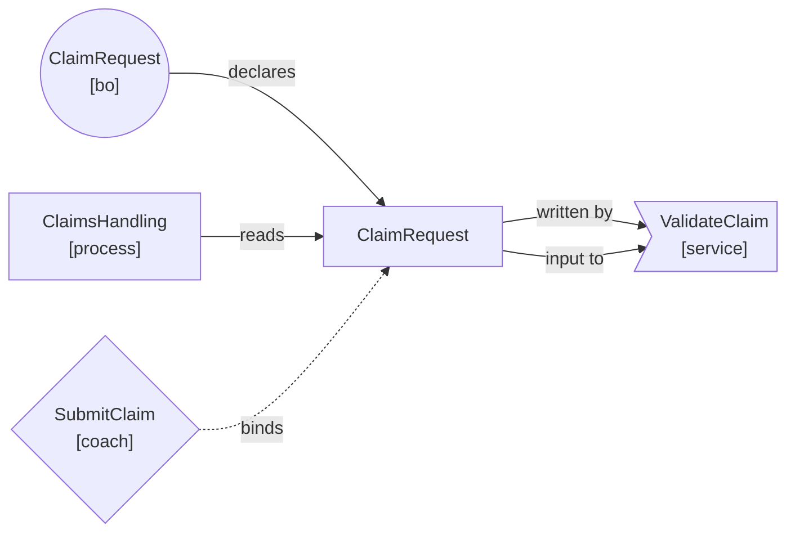

# Output format reference

Conventions for the dependency report sections and the Mermaid diagram the skill presents.

## Section order

1. Summary
2. Dependency graph (Mermaid)
3. Declarations
4. Read usages
5. Write usages
6. Service input bindings
7. Service output bindings
8. Coach bindings
9. Issues detected
10. Impact assessment

Present sections in the order listed above. If a section has no data, write `_None found._` under the heading.

## Dependency graph — Mermaid conventions

Use `flowchart LR` (left-to-right layout). The target BO/variable is always the central node.

### Node shape by artifact type

| Artifact type       | Mermaid shape syntax            | Example                          |
|---------------------|---------------------------------|----------------------------------|
| Target BO/variable  | `["label"]` (rectangle)         | `target["ClaimRequest"]`         |
| Business Object     | `(("label"))` (circle)          | `bo(("ClaimRequest\n[bo]"))`     |
| Process (BPD)       | `["label"]` (rectangle)         | `proc["ClaimsHandling\n[process]"]` |
| Service flow        | `>"label"]` (asymmetric/flag)   | `svc>"ValidateClaim\n[service]"]`|
| Coach               | `{"label"}` (diamond)           | `cch{"SubmitClaim\n[coach]"}`    |

### Edge labels

| Relationship           | Edge label      | Direction          |
|------------------------|-----------------|--------------------|
| Declares the target    | `declares`      | Artifact → target  |
| Reads the target       | `reads`         | Artifact → target  |
| Writes the target      | `written by`    | Target → artifact  |
| Service input binding  | `input to`      | Target → service   |
| Service output binding | `outputs`       | Service → target   |
| Coach binding          | `binds`         | Coach -.-> target (dashed) |

Use `-->|"label"|` for solid edges and `-.->|"label"|` for dashed coach bindings.

### Example snippet



## Tables

Each usage section uses a four-column markdown table:

| Artifact | Type | File | Detail |
|---|---|---|---|
| `ValidateClaim` | service | `obj/abc123/ValidateClaim.xml` | `[inputMapping] references 'ClaimRequest'` |

- `Artifact` — the name of the process, service, coach, or BO.
- `Type` — one of: `business-object`, `process`, `service`, `coach`, `other`.
- `File` — the basename of the XML file inside the TWX (full path available in JSON report).
- `Detail` — a short description of where/how the reference appears.

Deduplicate rows: if the same artifact appears multiple times for the same detail, show it once.

## Issues section

### Circular reference format

```
⚠️ **Circular BO reference:** `TypeA` → `TypeB` → `TypeA`

Each type in this chain directly or transitively references the next, which can
cause serialization and deep-copy failures at runtime.
```

List each cycle once. If multiple cycles share sub-paths, list each distinct cycle separately. Limit to 20 cycles maximum; if more are found, write "…and N more cycles" at the end.

### Over-coupling format

```
⚠️ **Over-coupling:** `ClaimRequest` is written by 5 services (`A`, `B`, `C`, `D`, `E`).
Consider splitting responsibilities or introducing a dedicated update service.
```

### Redundant service call format

```
🔍 **Redundant call candidate:** In `ClaimsHandling`, services `A` and `B` both consume
`ClaimRequest` as input. Verify whether each call is distinct or duplicated.
```

Use 🔍 (not ⚠️) to signal these are candidates requiring human review, not confirmed defects.

### Orphaned variable format

```
🔍 **Orphaned variable:** 'claim' : ClaimRequest is declared but never read or written
within 'NotifyApplicant'. Confirm it is not populated via service mapping before removing.
```

### Write-only variable format

```
⚠️ **Write-only variable:** 'ClaimRequest' is written in 'EnrichClaim' but never read
or consumed downstream. This data may be dead code.
```

### Missing output mapping format

```
⚠️ **Missing output mapping:** Activity 'inputMapping' in 'ValidateClaim' maps
'ClaimRequest' as input but has no output mapping — any mutations inside the service
are discarded.
```

### Unused BO type format

```
⚠️ **Unused BO type:** BO 'AuditEntry' is defined in the process app but no process
variable or service parameter uses it as a type.
```

### Stale coach binding format

```
⚠️ **Stale coach binding:** Coach 'SubmitClaim' binds to field 'claimantPhone' which
does not exist in 'ClaimRequest' definition.
```

### Read before write format

Linear/certain flow (⚠️):
```
⚠️ **Read before write:** Activity 'Evaluate Eligibility' in 'ClaimsHandling' reads
'ClaimRequest' before any write to it has been reached on this flow path (likely)
```

Ambiguous flow with parallel gateway or loop (🔍):
```
🔍 **Read before write:** Activity 'Evaluate Eligibility' in 'ClaimsHandling' reads
'ClaimRequest' before any write to it has been reached on this flow path
(candidate — parallel/loop flow present)
```

Use ⚠️ when the flow is linear or purely branching (no parallel gateways, no back-edges). Use 🔍 when parallel gateways or loop back-edges are detected, making the ordering ambiguous on at least one path. Always note the process name and activity name explicitly.

## Impact assessment format

Use one subsection per change type, with a coloured risk indicator:

```markdown
### 🟢 Add Field — Low risk

Adding a new field is backward-compatible. Existing consumers are unaffected.

### 🔴 Delete BO — High risk

Deleting the BO affects all 12 consumer(s) found.

**Must update:** `ClaimsHandling`, `ValidateClaim`, `SubmitClaim`
```

Risk colour coding:
- 🟢 Low — no write consumers and no coach bindings, or change is backward-compatible.
- 🟡 Medium — limited write consumers (≤ threshold) or few coach bindings.
- 🔴 High — write consumers exceed threshold, or coach bindings > 2, or BO deletion with consumers.

## Save offer

After presenting the full report, end with:

> "Would you like me to save the dependency diagram as a standalone `.mmd` file? I can also save a copy of the full report as markdown to your project directory."

When the user confirms, write the Mermaid block (content only, no fences) to `<TargetName>-dependency-graph.mmd` and the full report to `<TargetName>-dependency-report.md` in the project root or user-specified path.
