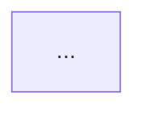

# Documentation output format

This reference defines what the `baw-project-doc` skill produces and how it is structured.

---

## Output: a single Markdown document

The skill generates one Markdown file per documented application or process. It is
written to:

```
docs/baw/<AppName>/<AppName>-documentation.md
```

If multiple processes are documented in one run, each process gets its own section
inside the same document (H2 per process). Business objects shared across processes
are collected into a single "Business Objects" section at the end.

---

## Document structure

```
# <Application Name> — BAW Application Documentation

**Generated:** <date>
**Source:** TWX (`<filename>.twx`) | BPMN+XSD (`<name>.bpmn` + `<name>.xsd`) | ZIP (`<name>.zip`)
**Snapshot:** <snapshot label or branch ID>

## Table of Contents
...

---

## 1. Application Overview
Brief summary from the process app description (if available).
Toolkit dependencies listed.

---

## 2. Processes

### 2.1 <Process Name>

**Description:** <from Header.description>
**Swimlanes / Participants:**
| Lane | Type |
|---|---|
| Hiring Manager | Human |
| System | Automated |

#### Process Flow

Mermaid flowchart using the Diagram.step[] data:



#### Steps

Table of every step with performer and description:

| # | Step | Type | Performer | Description / Notes |
|---|---|---|---|---|
| 1 | Submit position request | Human Task | Hiring Manager | — |
| 2 | New position? | Gateway | — | Branch: Yes → GM approval; No → HR |
| 3 | Review new position request | Human Task | General Manager | Timer: Overdue approval |
...

#### Timers & Boundary Events

List any `attachedTimer` entries with their names and descriptions.

#### Process Variables

| Variable | Type | List? | Description |
|---|---|---|---|
| requisition | Requisition | No | Is the process variable for... |
| candidates | Candidate | Yes | List of candidate BOs |

---

## 3. Services
(Populated from TWX service artifacts — see `TWX_ANALYSIS.md`)

For each service:

### 3.x <Service Name> (<type>)

**Type:** Integration Service | General System Service | Ajax Service | ...
**Description:** ...

#### Parameters
| Name | Direction | Type | Description |
|---|---|---|---|

#### Steps / Components
Brief description of what the service does (connectors, SQL calls, REST calls, scripts).

---

## 4. Business Objects

One subsection per non-primitive business object type. For TWX input, business objects are identified via the `type="businessObject"` attribute in `package.xml`'s `<objects>` index (flat layout) or from the `objects/business-object/` subfolder (legacy ≤ 8.5 layout). For BPMN+XSD/ZIP input, sourced from the companion `.xsd`.

### 4.x <ObjectName>

**Description:** ...

| Field | Type | List? | Notes |
|---|---|---|---|
| reqNum | String | No | — |
| approvalNeeded | Boolean | No | — |
| empNum | Integer | No | — |

---

## 5. Coach Views / Widgets
(TWX path only — sourced from `objects/coach-view/`)

For each Coach View:

### 5.x <ViewName>

**Configuration options:** ...
**Bound business object:** ...
**Event handlers:** load, change, ...

---

## 6. Integration Points

A consolidated list of all external endpoints, data sources, and WSDL references
discovered across services and processes.

| Type | Reference | Used by |
|---|---|---|
| REST endpoint | https://api.example.com/... | Service: Lookup Employee |
| SQL data source | jdbc/HRDatabase | Service: Query Candidates |
| WSDL | http://legacy.internal/... | Service: Legacy Approval |

---

## 7. Assumptions & Gaps

Anything that could not be determined from the available data — missing descriptions,
unresolvable references, skipped artifacts. One bullet per item.
```

---

## Mermaid diagram rules

Use the same conventions as `generate-baw-bpmn`:
- Start/end events: `(["Label"])` — round ends
- Human tasks: `["Lane: Label"]` — rectangles
- Service/system tasks: `["⚙ Label"]` — rectangles with gear prefix
- Gateways: `{"Label?"}` — diamonds
- Timer boundary events: dashed arrow `task -.->|"timer name"| timer_node`
- Label every gateway branch with `-->|"branch label"|`
- Use `classDef` to colour-code by lane (consistent with `generate-baw-bpmn` visual conventions)

---

## Completeness rules

- Every process step must appear in the Steps table.
- Every process variable must appear in the Process Variables table with its type.
- Every business object in `DataModel.validation` that is not a primitive type must
  get its own subsection in Section 4.
- If a section has no data (e.g. no services found in a TWX), include the heading
  with a note: `> No services found in this application.`
- Never omit a section silently.
